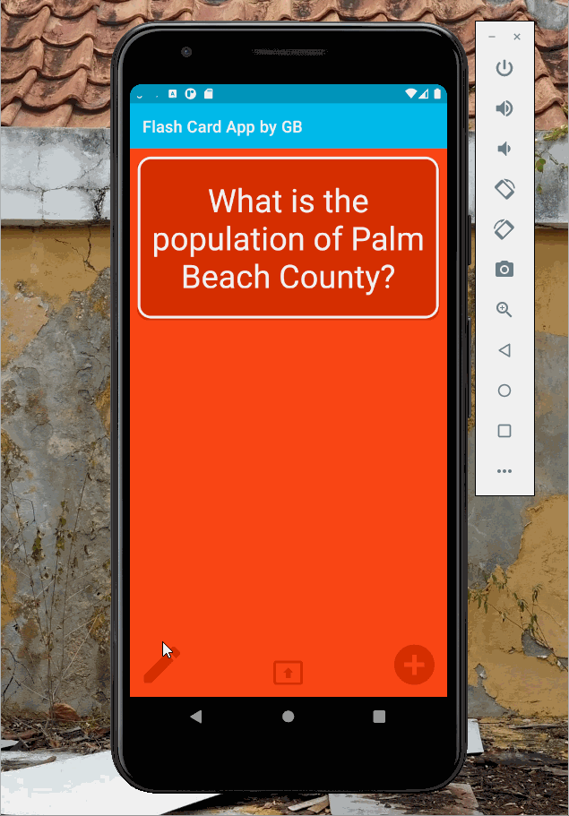
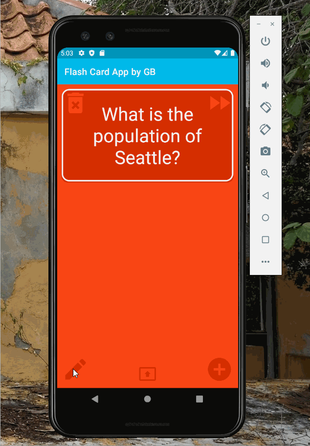
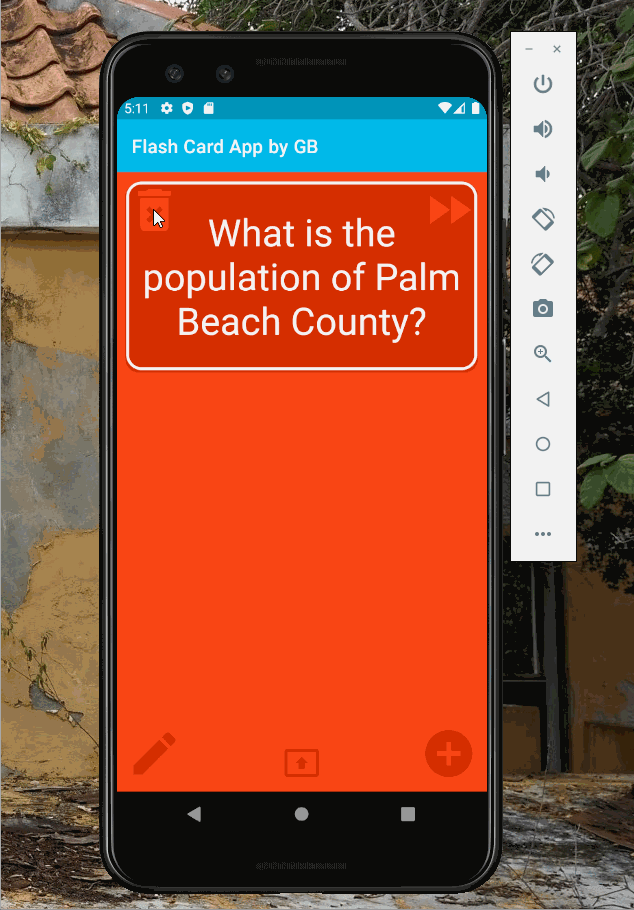

"# newProject" 
Set up for new Code Path project

Lab work from session 2:

Create a README in your GitHub repository and paste in the contents of this Lab 1 README Template -[x]

In the README, mark off all the features you implemented, using the following syntax-[x] -[x]

Record a GIF walkthrough of your app that showcases the features you implemented. -[x]

Add the GIF file to your repository and add the link in your README so it animates when the README is viewed. -[x]

Optional Tasks
1. Build in logic to toggle the flashcard between the question side and the answer side -[x]
2. Style the question and answer side of the card to better distinguish between the two sides -[x]
3. Further customize and style the card -[x]
4. Add selectable multiple choice answers beneath the card -[x]
5. Change the background color of the multiple choice answers when clicked to indicate whether the question was answered correctly -[x]
6. Add a button that will toggle hiding and showing the answer choices -[x]

 

## Lab 2

### App Description
App now has multiple choice quiz question. Can be changed and edited.

### App Walk-though

 

## Required
- [x] User can click on a ‘+’ button that takes the user to new ‘Add Card Screen’
- [x] The 'Add Card Screen' has a cancel button to take the user back to the main screen
- [x] User can enter and submit a Question and Answer through the 'Add Card Screen'
- [x] User will see the card they just created on the main screen when they press the 'Save Button'
- [x] Push your progress to GitHub!

## Optional
- [x] User can edit a card
- [x] An error message is shown if the user doesn't enter both a Question and an Answer
- [x] A notification is shown if the card was created successfully
- [x] User can also enter multiple choice answers when creating a card
- [x] App is further styled and customized!

## Lab 3

## Description
App now works with a local database for persisting data

## App Walk-through

 
and deletion
 

## Required
- [x] User can create a card and still see their created card when the app is relaunched.
- [x] User can create muliple cards and browse through all created cards

## Optional
- [x] User can delete a card and no longer see it in their deck anymore
- [x] Flashcards are shown in random order instead of the order they were created in
- [x] User can edit a card and see the edit saved when they browse through their deck of cards
- [x] User can create flashcards with multiple answers and be able to browse through cards with multiple choice answers shown
